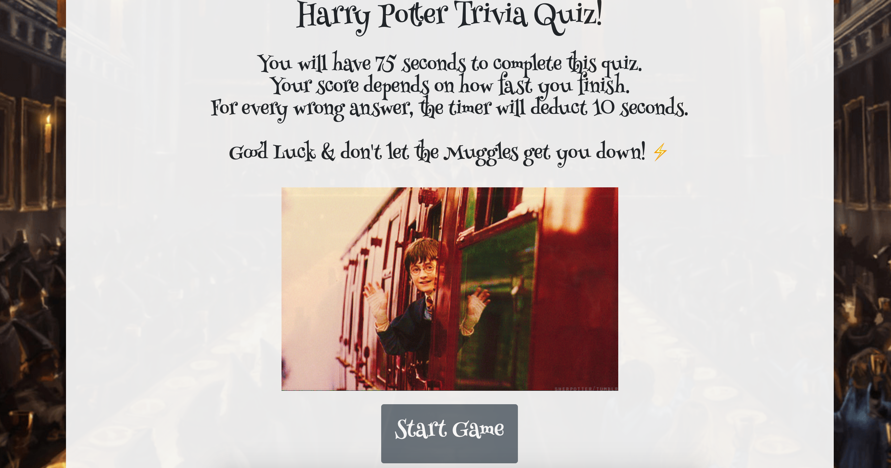

# Harry Potter Trivia Quiz
Created during Week 4 of UPenn Coding Bootcamp.

## Overview
In this assignment, the challenge was to create an interactive multiple choice question quiz. From scratch, the quiz must be timer-based and stores high scores in client-side local storage. 

## Utilizing the App
- View the app: [Here](https://acucunato.github.io/trivia-quiz/ "Here")
- To start, click on "Start Game" button.
- User will have 75 seconds to complete the quiz.
- If user answers incorrectly, the timer will deduct 10 seconds.
- The users score is equal to time remaining.
- At the end of the quiz, the user will be prompted to enter their initals and to be added to the "Top of the Class" List.
- If the timer runs out, a message will alert the user that they have failed the quiz.

## Demo

## Tech used
- HTML
- CSS
- Bootstrap
- Javascript

## Contributers
- Alyssa Cucunato